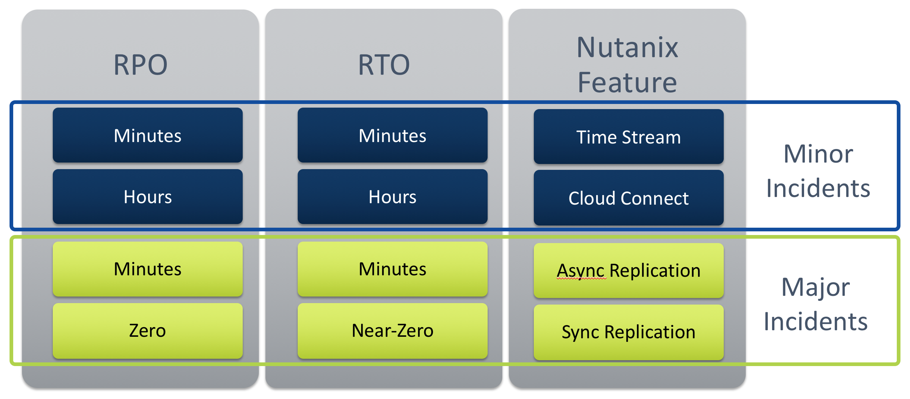
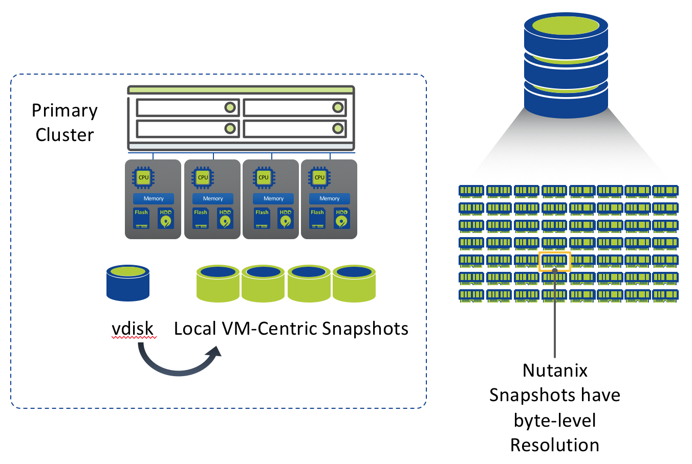
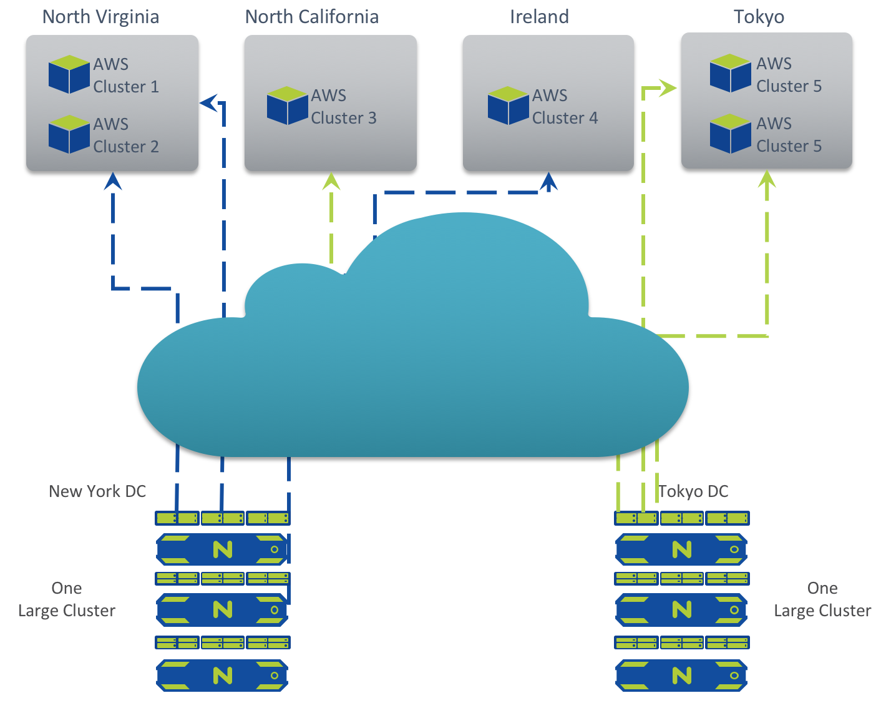
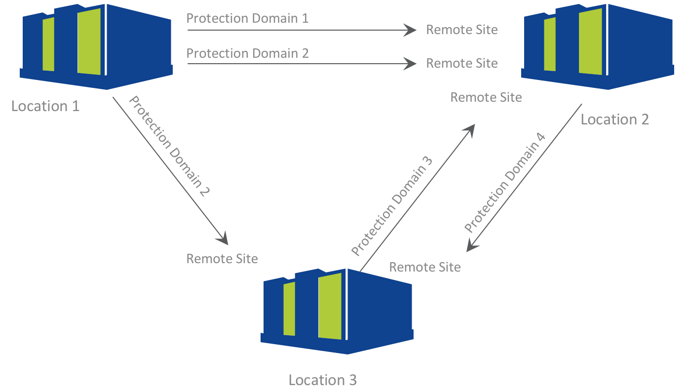
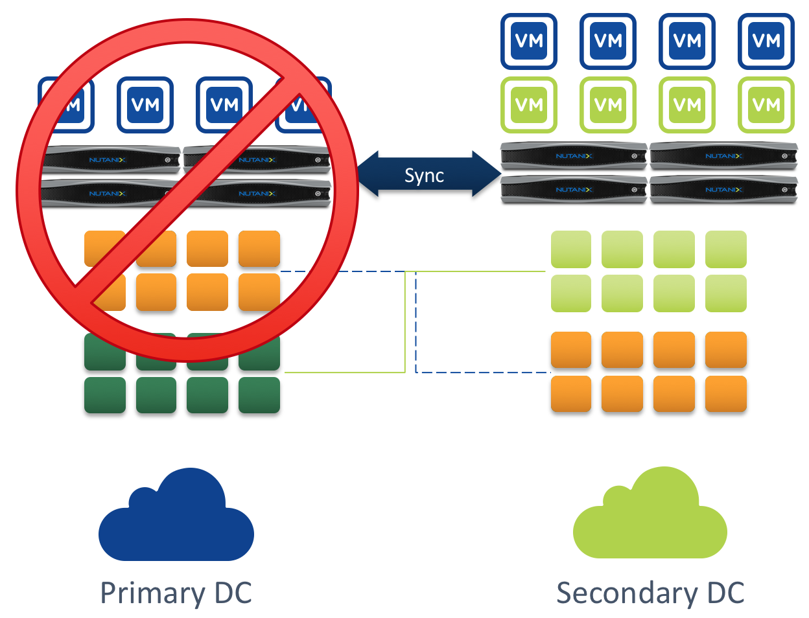
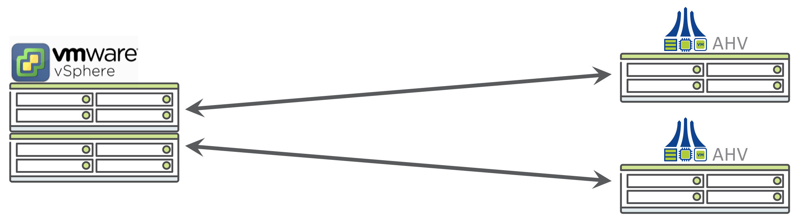
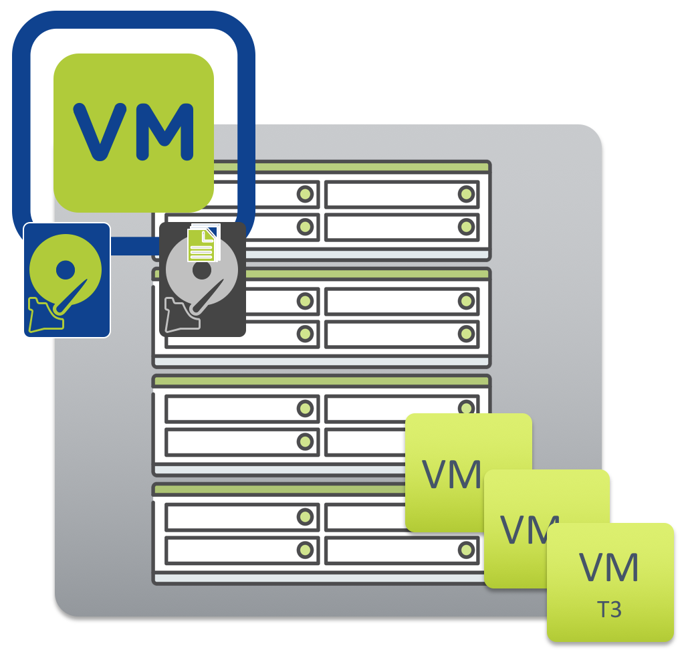

.. _backup_and_dr:

---------------------
Nutanix Backup and DR
---------------------

Comprehensive Backup and DR Solution
++++++++++++++++++++++++++++++++++++

Nutanix Local Snapshots (Time Stream)
.....................................

Use Cases

- Protection against Guest OS corruption
- Snapshot VM environments
- Self-Service File Level Restore

Key Points

- VM granularity
- No performance impact
- Lower $ / GB with storage heavy/only nodes

Nutanix Cloud Connect
.....................

What is it

- Hybrid cloud solution from Nutanix
- Integration with Azure and AWS

Use Cases

- Archiving
- Backup

Key Points

- Easy to setup and manage
- WAN optimized replication
- Interop with Nutanix DR portfolio

Asynchronous Replication
........................

Use Cases

- Protection against VM corruption/deletion
- Protection against complete site failure(s)

Points of differentiation

- Multiple DR topologies
- Multiple retention policies
- WAN optimized replication
- Rest API driven(customer DR runbooks)
- VM and application level consistency

Metro Availability and Sync Replication
.......................................

Use Cases

- Protection against complete site failure(s)
- No data loss in case of a site failure

Key Points

- Easy to setup and manage
- Interop with a-sync replication(3rd site)
- Witness Option
- Rest API driven (customer DR runbooks)

Cross-Hypervisor Backup and DR
..............................

Value Proposition and Benefits

- Enjoy hypervisor choice while using integrated backup and DR
- All the benefits of Nutanix async remote replication technologies
- Automatic migration of configuration and VM conversion

Self-Service File Restore
.........................

What is it?

- Item level recovery of independent files from VM Snapshots
- Eliminates the need to recover entire VM

Points of differentiation

- Self-service recovery without Admin intervention
- Easy to setup and manage
- Viable backup solution for mid sized customers and Tier-2 workloads

