.. _lab_2:

------------------------------
Lab 2 - Sizer (Instructor Led)
------------------------------

Overview
++++++++

Learn how Nutanix engineers and partners can leverage the Sizer tool to select the right combination of hardware.

Using Notes
+++++++++++

Open \http://sizer.nutanix.com

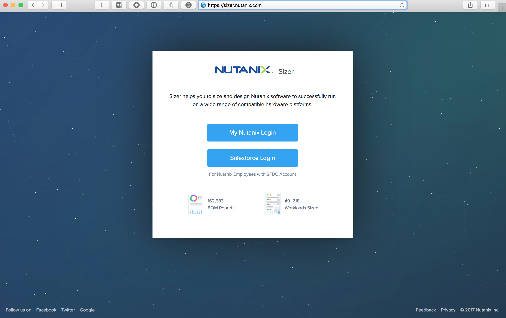

Login with your **My Nutanix Login** credentials.

Click **+ Create New Scenario**, and create a demo Scenario.

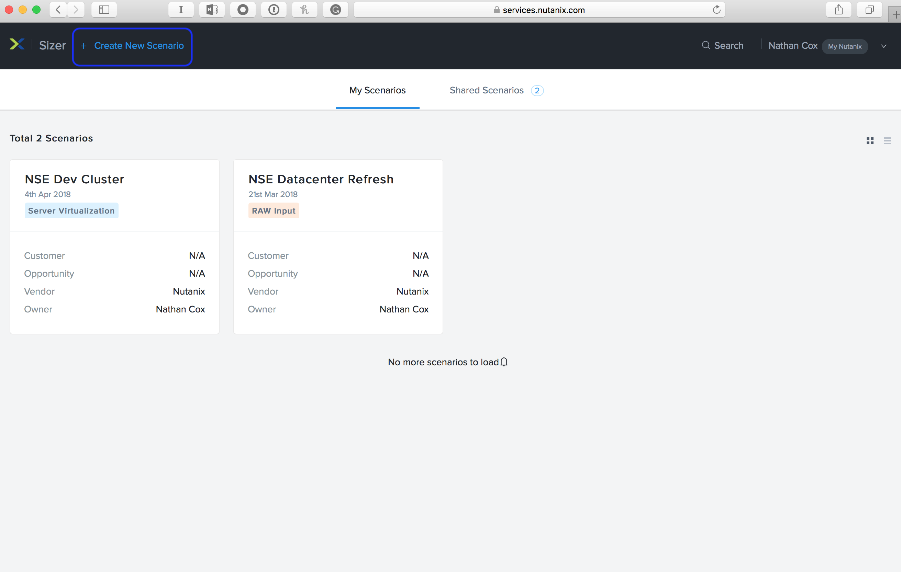

Enter a **Scenario Name**.

Highlight the different vendor hardware models that support Nutanix software.

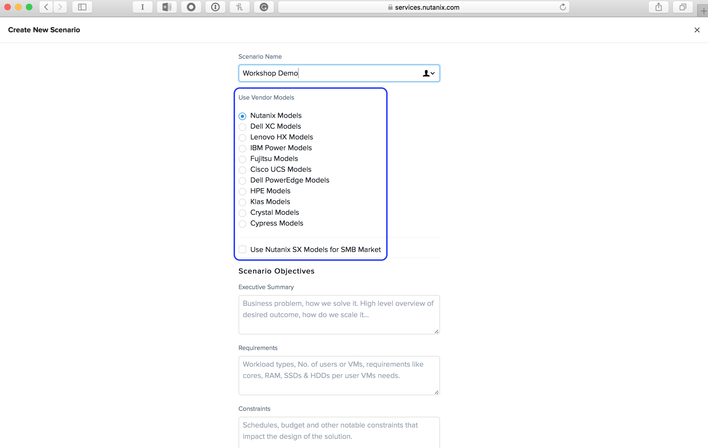

Highlight the scenario objective fields, and why it is important to put as much info in as possible.

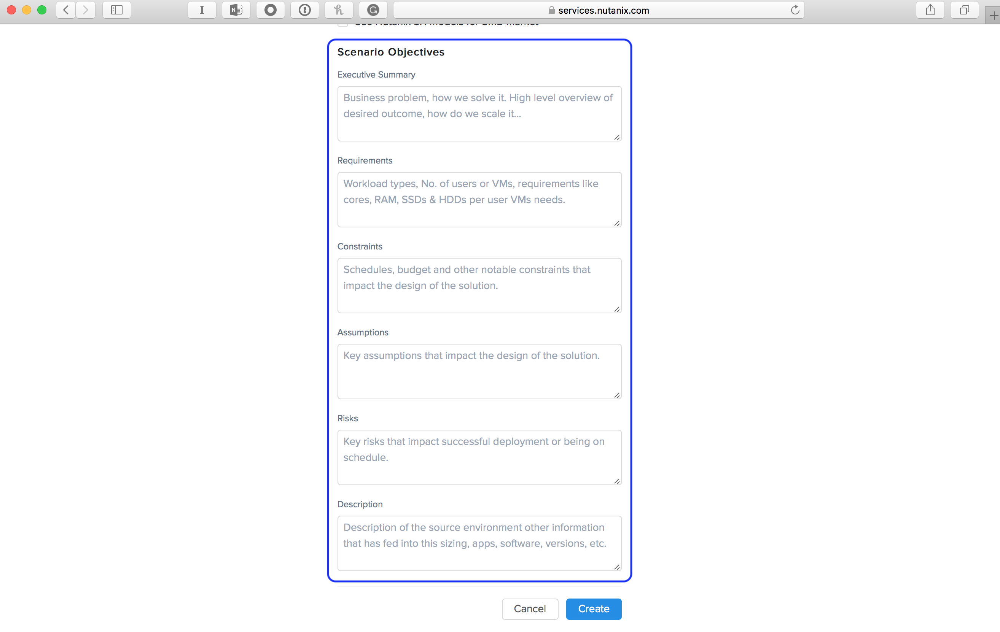

Click **+ Add Workload**.

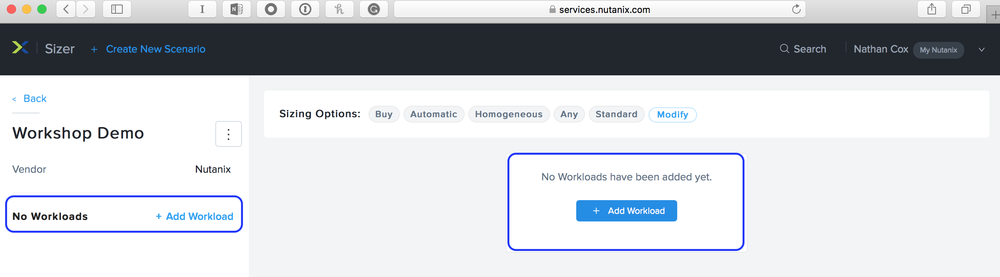

Enter a **Workload Name**.

Highlight the different workload types.

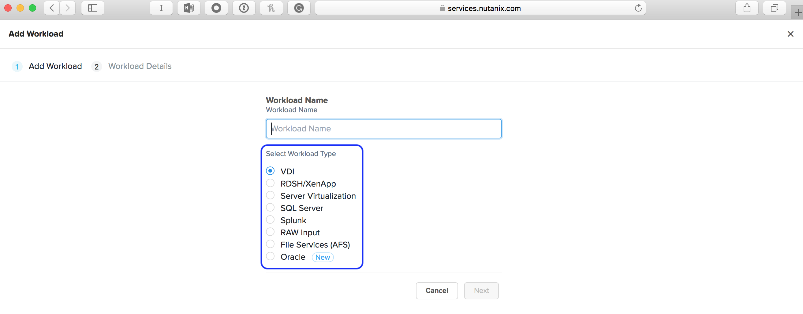

Select **Server Virtualization**, and click **Next**.

Fill out the following fields and click **Save**:

- **Server Profile Size** - Large
- **Number of VM's** - 100
- **Container Replication Factor** - RF2
- **Disable Compression for Pre-Compressed Data** - No
- **Erasure Coding** - Unchecked
- **Block Awareness** - Unchecked
- **Encrypt Storage for VM** - Unchecked
- **Data Protection** - No

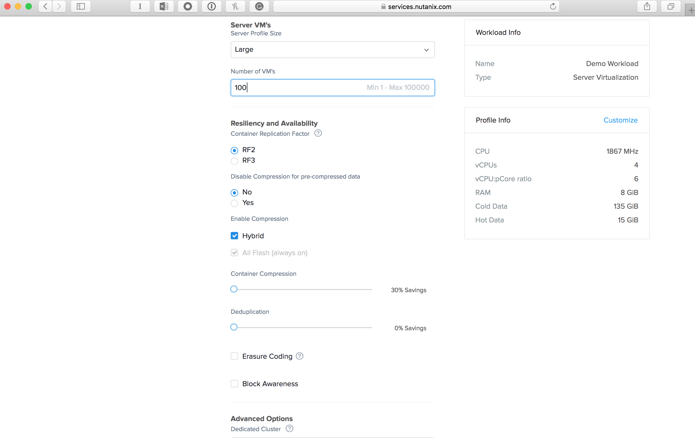

Click **Modify** in the **Sizing Options** section.

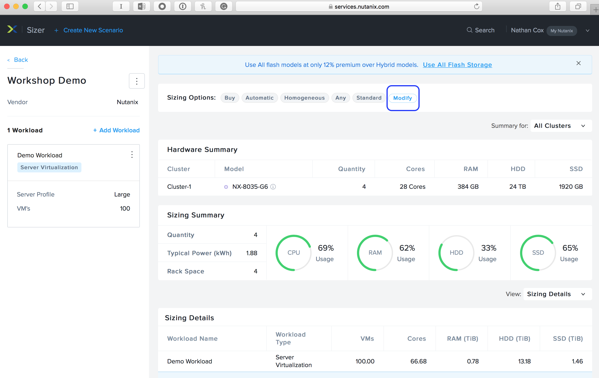

Highlight the different **Sizing Options** under **Automatic**.

.. figure:: images/ahv_lab02_09.png

Highlight the different changes you can make under **Manual**.

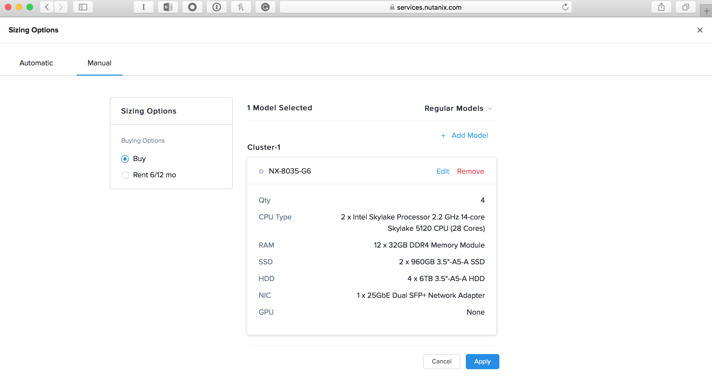

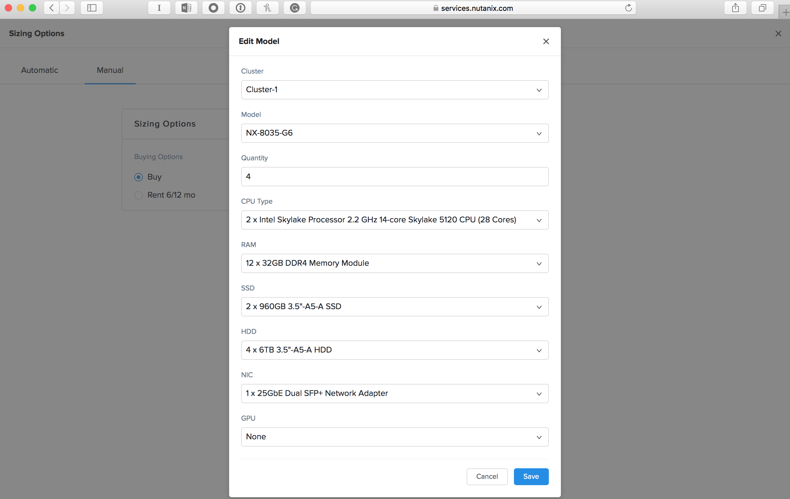

Highlight and explain **Sizing Details**.

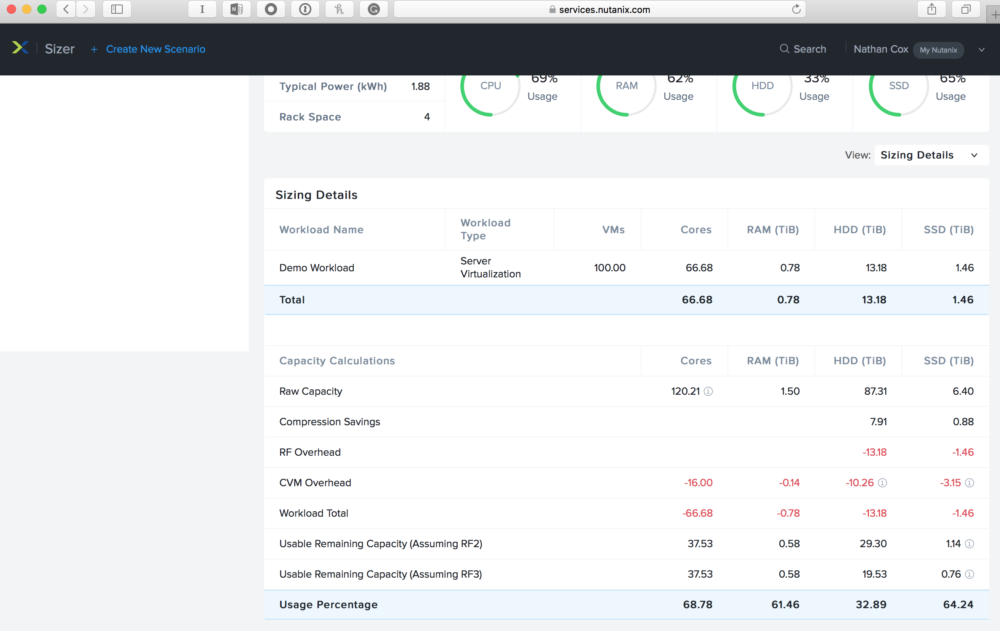

Highlight and explain **Sizing Charts**.

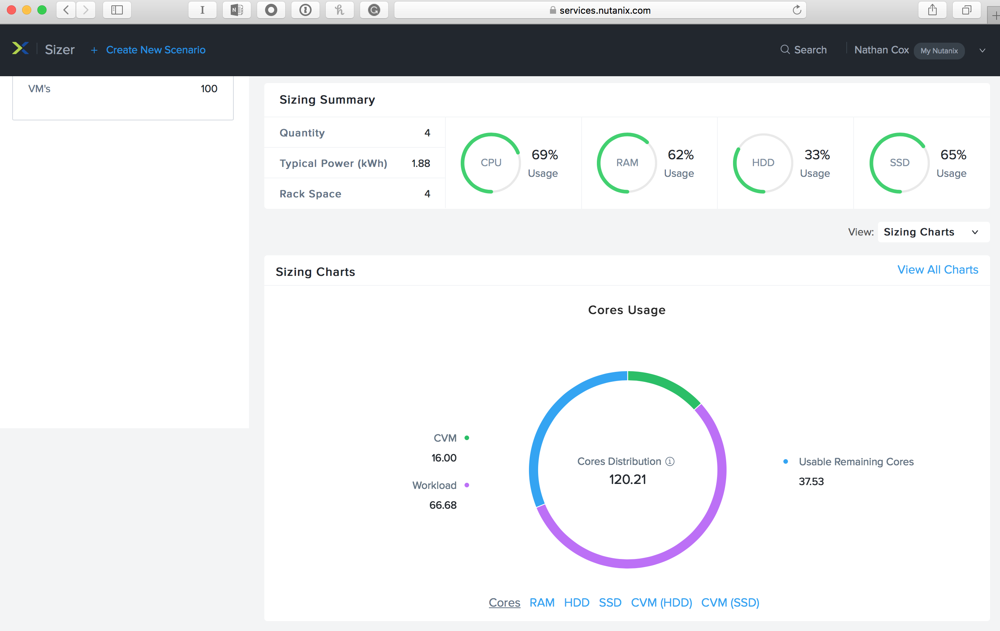

Highlight and explain **Financial Analysis**.

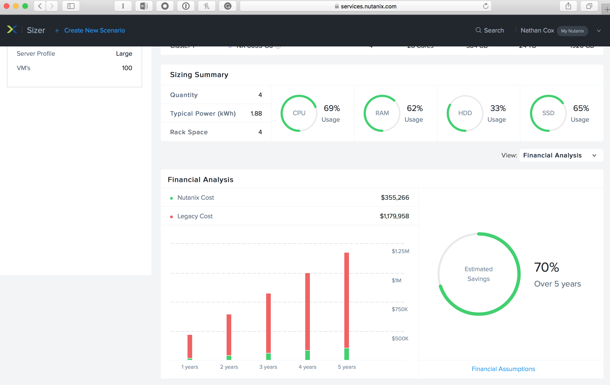

Highlight and explain **Rack View**.

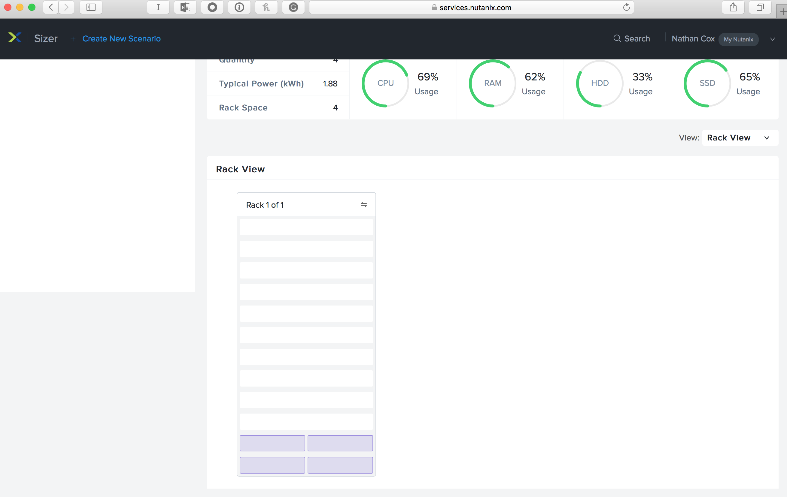

Click the :fa:`ellipsis-v`, and then click **Download BOM**.

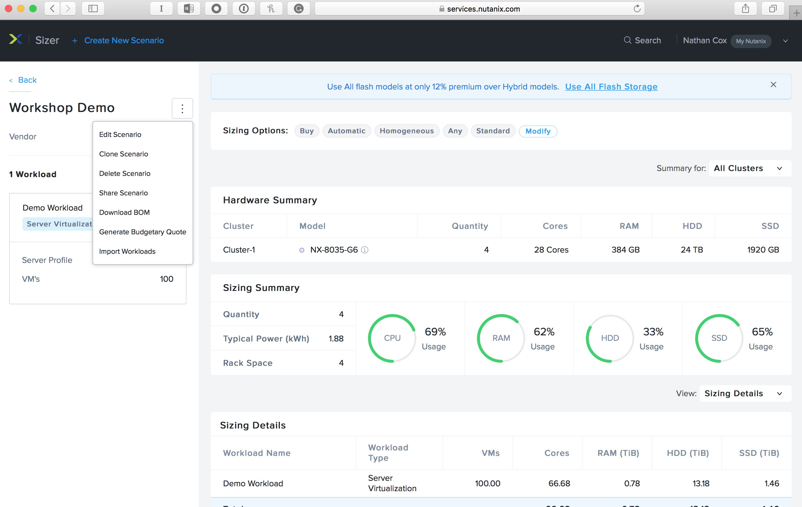

Ensure that all options are checked, and click **Download**.

.. figure:: images/ahv_lab02_17.png

Review the BOM.

.. literalinclude:: BOM-Workshop_Demo.pdf

Takeaways
+++++++++

- Sizer is an excellent tool to ensure a coorectly sized Nutanix Software solution.
-	Sizer is available for customers and prospects here: \http://go.nutanix.com/size-your-data-center.html
- Demo Video on YouTube: \https://www.youtube.com/watch?v=uS8C5bzYr_s
