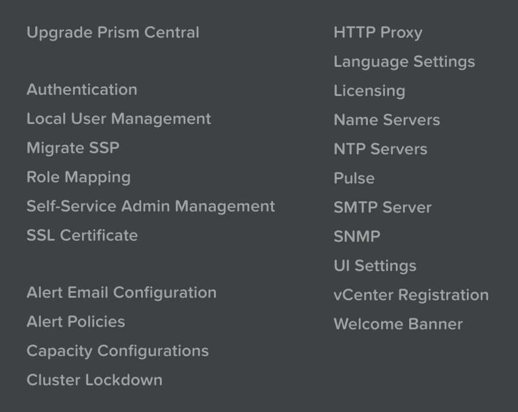
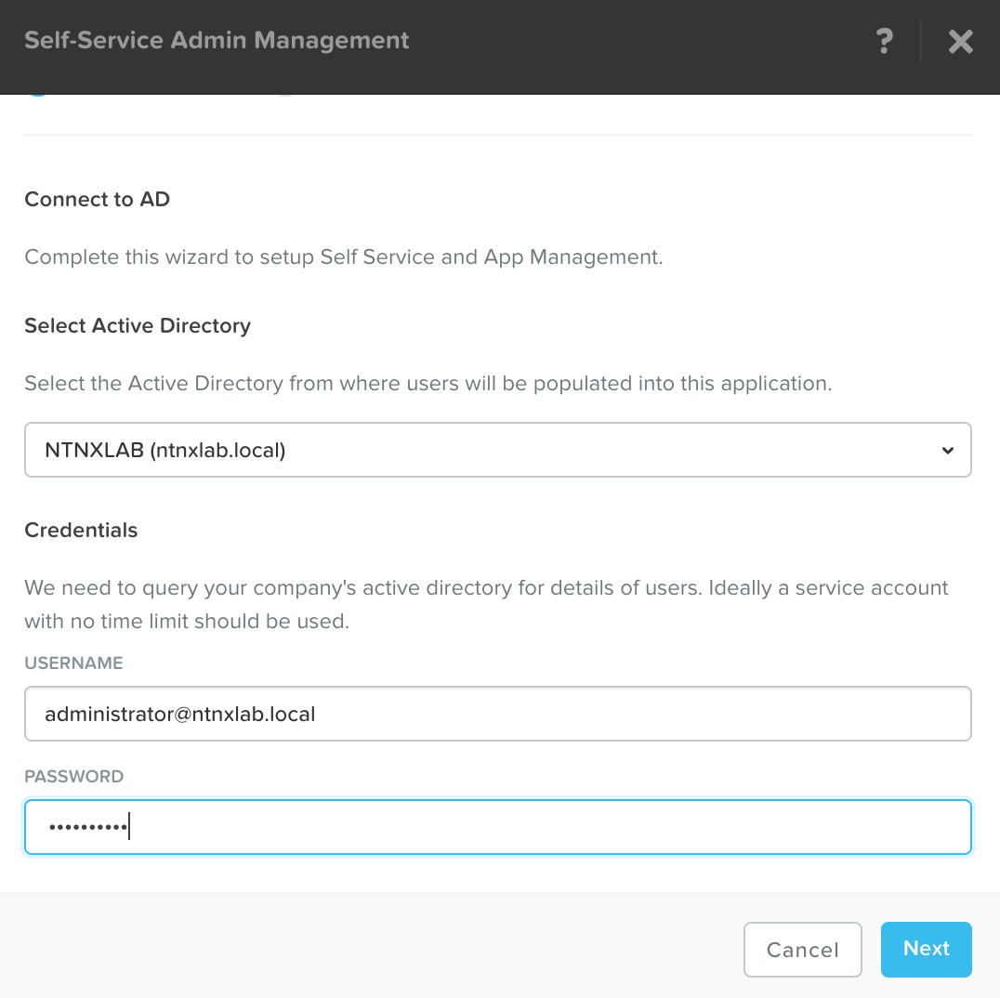
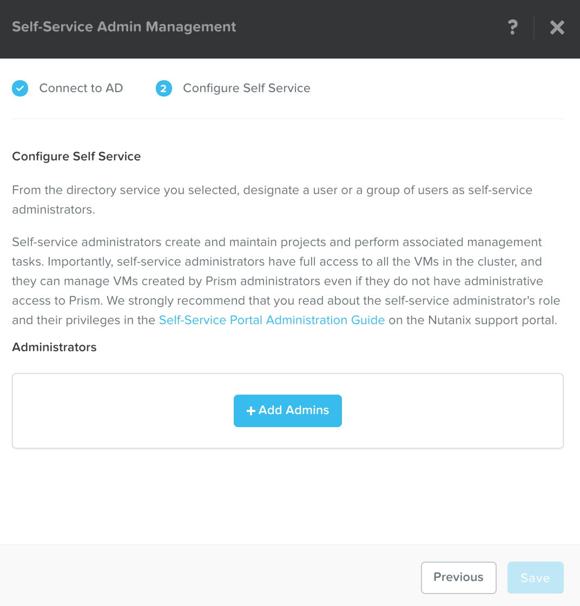
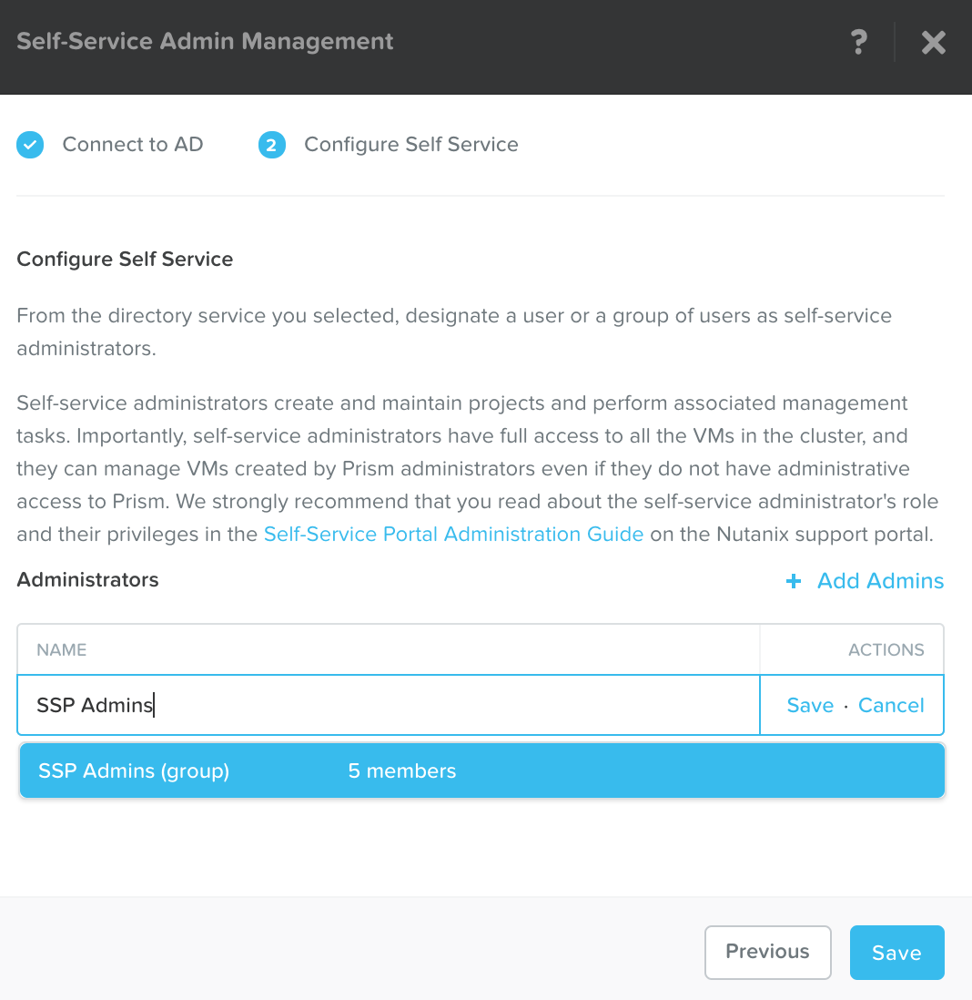
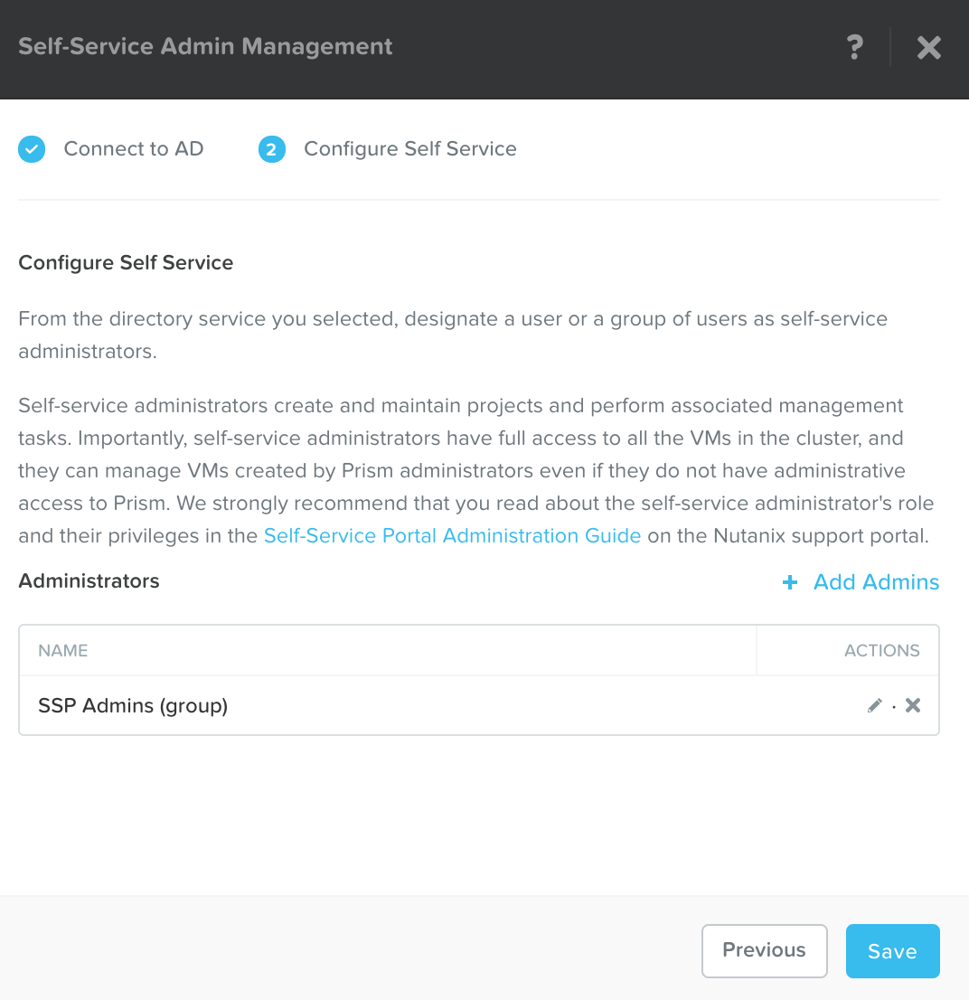

.. _lab_basic_configuration:

-------------------------
Lab - Basic Configuration
-------------------------

Overview
++++++++

In this lab we will go over common configuration items for both Prism Element, and Prism Central.

Prism Element Basic Configuration Items
+++++++++++++++++++++++++++++++++++++++

UI Settings
...........

Prism allows you to make changes to the default UI values for session timeouts, and the automated background.

You could change the UI Settings to some like below:

In **Prism**, click :fa:`cog` **>  UI Settings**

Fill out the following fields and click **Save**:

- **Enable Animated Background - unchecked
- **Session Timeout for Current User** - 30 minutes
- **Default Session Timeout for all Users** - 2 hours
- **Session Timeout override** - Allow unlimited

Configure Data Services IP
..........................

If you are going to use AFS or ABS, you will need to set the Data Services IP.

Select the Cluster in the upper left-hand corner

Fill out the following fields and click **Save**:

- **ISCSI Data Services IP** - 10.21.XX.38 (What it would be set to in the HPOC Environment you are using)

Configure Storage Containers
............................

Containers are software-defined, logical constructs for managing storage policy that greatly simplify storage management. Containers are similar to datastores in ESXi.

Let's use Prism to perform a basic container setup.

In **Prism > Storage**, click ** Storage**, click **Table**, then click **+ Storage Container**.

Use the following specifications (with **Advance Settings**), and click **Save*:

- **Name** - *Unique Name*
- **Advertised Capacity** - 5 GiB
- **Compression** - Enabled (inline 0 mins)
- **Deduplication** - Cache Only
- **Erasure Coding** - Disabled

.. figure:: images/basic_config_01.png

You can create multiple containers with different policies.

.. note::

  Containers do not reserve any actual disk space—they are policies with a soft limit that trigger alerts but do not stop new data from being written to the container.

Explore the configuration basics further.

Go back to the container you created above and try adding another 10 GiB to the advertised capacity. While you’re in that window, what is the redundancy factor for the container you created in the first task?

.. figure:: images/basic_config_02.png

Setup Authentication and Role Mapping
.....................................

In most environments you will want to connect your Nutanix cluster(s) to your companies Active Directory or LDAP servers.

This allows the admins to login with those credentials instead of local Nutanix cluster credentials.

In **Prism**, click :fa:`cog` **> Authentication**

Click **+ New Directory**

Fill out the following fields and click **Save**:

- **Directory Type** - Active Directory
- **Name** - NTNXLAB
- **Domain** - ntnxlab.local
- **Directory URL** - ldaps://10.21.XX.40
- **Service Account Name** - administrator@ntnxlab.local
- **Service Account Password** - nutanix/4u

.. figure:: images/basic_config_03.png

Click on the yellow ! next to **NTNXLAB**

.. figure:: images/basic_config_04.png

Click on the **Click Here** to go to the Role Mapping screen

Click **+ New Mapping**

Fill out the following fields and click **Save**:

- **Directory** - NTNXLAB
- **LDAP Type** - user
- **Role** - Cluster Admin
- **Values** - administrator

.. figure:: images/basic_config_05.png

Close the Role Mapping and Authentication windows

Prism Central Basic Configuration Items
+++++++++++++++++++++++++++++++++++++++

UI Settings
...........

Prism Central has similar configuration options for UI Settings

You could change the UI Settings for Prism Central to match what you set for Prism Element above:

In **Prism Central**, click :fa:`cog` **>  UI Settings**

Fill out the following fields and click **Save**:

- **Enable Animated Background - unchecked
- **Session Timeout for Current User** - 30 minutes
- **Default Session Timeout for all Users** - 2 hours
- **Session Timeout override** - Allow unlimited

Setup Authentication and Role Mapping
.....................................

Prism Central has similar configuration options for connecting to your Nutanix cluster(s) to your companies Active Directory or LDAP servers.

.. note::

  To use Self-Service Portal (SSP) & Calm, you will need to setup **Authentication**.

In **Prism Central**, click :fa:`cog` **> Authentication**

Click **+ New Directory**

Fill out the following fields and click **Save**:

- **Directory Type** - Active Directory
- **Name** - NTNXLAB
- **Domain** - ntnxlab.local
- **Directory URL** - ldaps://10.21.XX.40
- **Service Account Name** - administrator@ntnxlab.local
- **Service Account Password** - nutanix/4u

.. figure:: images/basic_config_03.png

Click on the yellow ! next to **NTNXLAB**

.. figure:: images/basic_config_04.png

Click on the **Click Here** to go to the Role Mapping screen

Click **+ New Mapping**

Fill out the following fields and click **Save**:

- **Directory** - NTNXLAB
- **LDAP Type** - user
- **Role** - Cluster Admin
- **Values** - administrator

.. figure:: images/basic_config_05.png

Close the Role Mapping and Authentication windows

Configure Self Service Portal
.............................

We will use the following user information

+-----------------+-----------------------+--------------------------------+
| **Group**       | **Usernames**         | **Password**                   |
+-----------------+-----------------------+--------------------------------+
| SSP Admins      | adminuser01-25        | nutanix/4u                     |
+-----------------+-----------------------+--------------------------------+
| SSP Developers  | devuser01-25          | nutanix/4u                     |
+-----------------+-----------------------+--------------------------------+
| SSP Power Users | poweruser01-25        | nutanix/4u                     |
+-----------------+-----------------------+--------------------------------+
| SSP Basic Users | basicuser01-25        | nutanix/4u                     |
+-----------------+-----------------------+--------------------------------+

In **Prism Central**, click :fa:`cog` **> Self-Service Admin Management**.

Fill out the following fields and click **Next**:

- **Domain** - ntnxlab.local
- **Username** - administrator@ntnxlab.local
- **Password** - nutanix/4u

Click **+Add Admins**

Enter **SSP Admins**, and Click **Save**

Click **Save**

.. note::

  If you would like more hands on with SSP, please look at the Optional SSP Lab.

Takeaways
+++++++++
