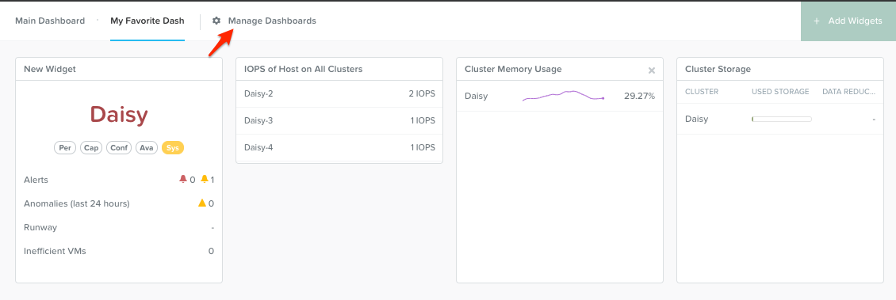

.. _lab_basic_configuration:

-------------------------
Lab - Basic Configuration
-------------------------

Overview
++++++++

In this lab we will go over common configuration items for both Prism Element, and Prism Central.

Prism Element Basic Configuration Items
+++++++++++++++++++++++++++++++++++++++

Configure Storage Containers
............................

Containers are software-defined, logical constructs for managing storage policy that greatly simplify storage management. Containers are similar to datastores in ESXi.

Let's use Prism to perform a basic container setup.

In **Prism > Storage**, click ** Storage**, click **Table**, then click **+ Storage Container**.

Use the following specifications (with **Advance Settings**), and click **Save*:

- **Name** - *Unique Name*
- **Advertised Capacity** - 5 GiB
- **Compression** - Enabled (inline 0 mins)
- **Deduplication** - Cache Only
- **Erasure Coding** - Disabled

You can create multiple containers with different policies.

.. note::

  Containers do not reserve any actual disk space—they are policies with a soft limit that trigger alerts but do not stop new data from being written to the container.

Explore the configuration basics further.

Go back to the container you created above and try adding another 10 GiB to the advertised capacity. While you’re in that window, what is the redundancy factor for the container you created in the first task?

.. figure:: images/basic_config_02.png

Prism Central Basic Configuration Items
+++++++++++++++++++++++++++++++++++++++

Takeaways
+++++++++
