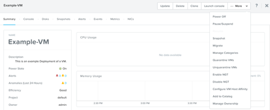
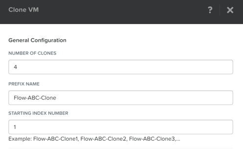
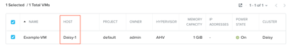
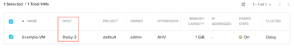
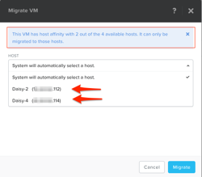

.. _lab_manage_workloads:

------------------------
Lab - Managing Workloads
------------------------

Overview
++++++++

Get experience using VM management tasks from Prism, which include power actions, searching, cloning, and migrating.

Workload Management
+++++++++++++++++++

Now that you have a couple VMs deployed, let’s have some fun and explore some of the VM management tasks with AHV.

Power Actions and Console Access
................................

Explore VM power actions and console access.

In **Prism Central > Explore > VMs**.

Locate the Linux VM you created in the previous lab (Linux_VM-*intials*). (Use Prism’s search function if necessary)

.. note::

  Note that the Power State column for that VM shows a red dot, indicating that the VM is powered off.

Now lets power on the VM:

Select the VM, then click **Power On** from the **Actions** drop-down menu.

.. note::

  See the list of available actions (Update, Delete, Clone, Launch Console, Power On, Pause/Suspend, Snapshot, Migrate, and so on).
  Note that Launch Console is shaded. This action is not available because the VM is off.

Next lets open a console session:

Select the VM, then click **Launch Console** from the **Actions** drop-down menu.

.. note::

  When the console window opens, note that there are three actions available in the console (Send CTRL-ALT-DEL, Take Screen Capture, and Power).

  Power On in the Actions menu changes to Power Off once the VM has been powered on. You can also click on the name of the VM to open a console window for a specific VM. This console window contains all of the options available under the Actions menu, performance-related information, and other relevant VM details.

.. note::

  In ESX:

  - The steps in this exercise could also be done from Prism while using an ESXi cluster which VMware vCenter instance is registered to Prism. The image below shows what the Actions drop down menu would look like for a VM hosted in ESXi VM versus one hosted in AHV side by side for comparison.

  .. figure:: images/manage_workloads_06.png

Prism Search
............

The Prism search function makes it easier to identify problems or find feature documentation in Prism Central. Use Prism Central’s search capabilities by typing a few search queries to see how easy this can make the tasks above.

Suggestions:

- vm cpu > 1
- vm mem > 2
- vm iops
- create vm
- powered on
- powered on cpu = 8

In **Prism Central >** :fa:`search`.

- Note the result types: Entity, Alerts, and Help.
- Click the star icon to save a search.

.. note::

  The search hot key (a slash mark, or /) can be used from anywhere in the Prism Central UI to bring up the search function.

Clone a VM
..........

In **Prism Central > Explore > VMs**.

Find and clone four copies of the CentOS-base virtual machine.

Select the VM, then click **Clone** from the **Actions** drop-down menu.

Fill out the following fields and click **Save**:

- **Number of Clones** - 4
- **Prefix Name**  - Flow-*intials*-Clone
- **Starting Index Number** - 1

Leave them powered off as they are used in the optional Flow Lab.

Migrate a VM Between Hosts
..........................

In **Prism Central > Explore > VMs**.

Locate the Linux Vm from the previous lab (Linux_VM-*intials*).

- If the VM is powered on, power it Off

You should see that it has no entry in the **Host** column when it is powered off.

Power on the VM, and make note of the **Hosts Name** in the **Host** column.

Select the VM, then click **Migrate** from the **Actions** drop-down menu.

You can either choose one of the other hosts in the cluster as a migration target for the VM, or accept the default and let AHV automatically select a location.

Click **Migrate** to finalize the action.

When the task completes, verify that your VM host location has changed from the host recorded above to the new location you selected.

Configure VM-to-Host Affinity Policies
......................................

In **Prism Central > Explore > VMs**.

Locate the Linux Vm from the previous lab (Linux_VM-*intials*).

- If the VM is powered on, power it Off

Select the VM, then click **Configure VM Host Affinity** from the **Actions** drop-down menu.

Select one **Host** to which the VM can have affinity, and click Save to finish.

Power On the VM, and verify it is on the **Host** you selected in the affinity policy.

Select the VM, then click **Migrate** from the **Actions** drop-down menu.

- This VM has host affinity set to host NTNXAHV-2. It cannot be migrated to any other host without setting the host affinity to that host.

Click **Cancel** to exit migration.

Select the VM, then click **Configure VM Host Affinity** from the **Actions** drop-down menu.

Select another **Host** to which the VM can have affinity, and click Save to finish.

Select the VM, then click **Migrate** from the **Actions** drop-down menu.

- There is now a drop-down menu displaying the available hosts.

Either select a host manually or allow AHV to select it, then click **Migrate**.

You should see that the VM has moved to the other host.

High Availability
.................

High availability is enabled by default for AHV and will restart VMs in a best-effort manner in the event of a host failure. Additional configuration can set resource reservations to ensure there is capacity during an HA event.

VMware HA works by providing high availability for virtual machines by pooling the virtual machines and the hosts they reside on into a cluster. The hosts in that cluster are then monitored and in case there is a failure, the VMs residing on the failed host would get restarted on alternate hosts. This feature must be turned on in vSphere, as opposed to AHV where it’s on by default without reservation.

Takeaways
+++++++++

- In this lab you got to experience first hand how AHV provides a complete set of tools and actions that can be done manage the VMs in the cluster.
- It is possible to register an ESXI cluster to Prism and be able to perform some of the basic VM management tasks right from Prism as well.
