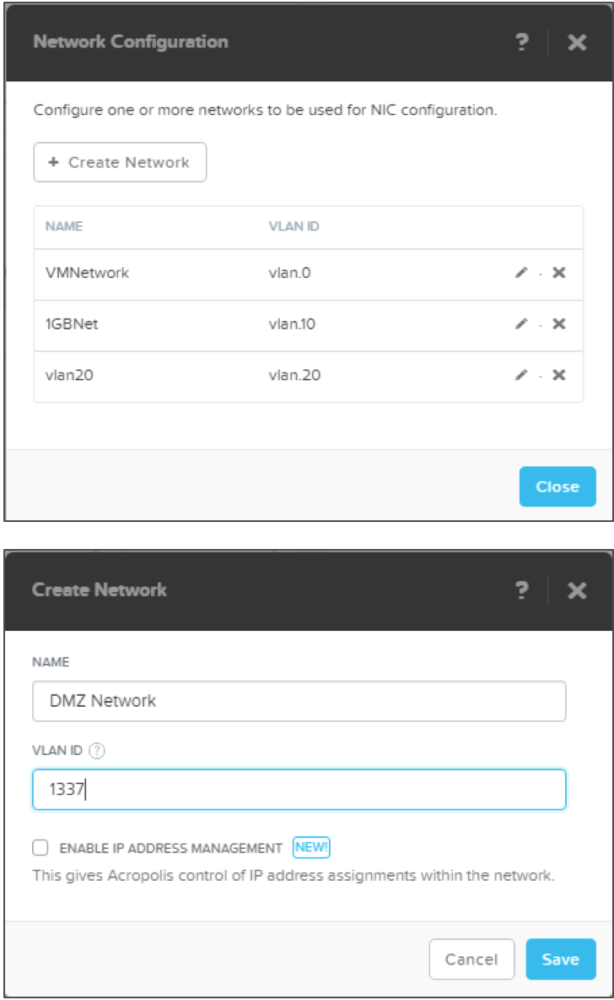
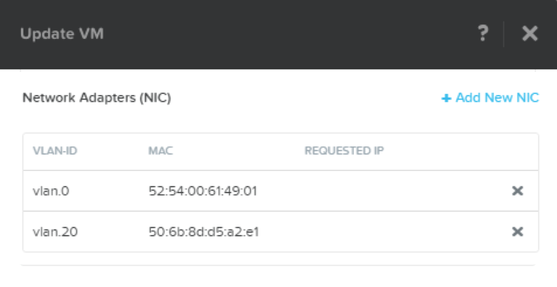
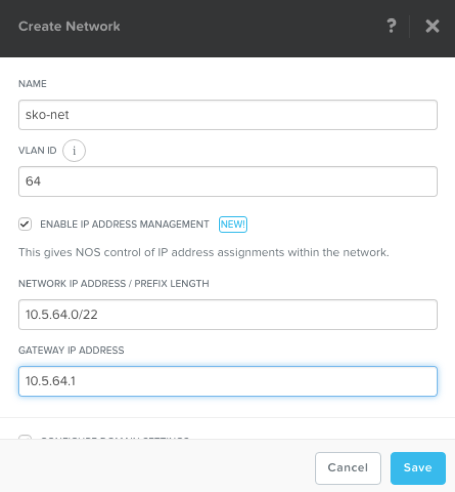
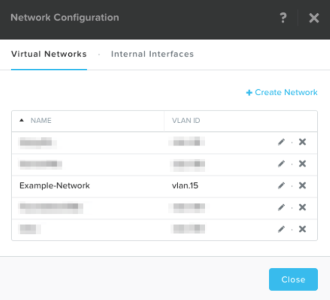

.. _lab_network_configuration:

------------------------------
Lab - Networking Configuration
------------------------------

Overview
++++++++

Learn how to set up a network in the cluster using Prism. The networks you create in the steps below provide VMs with connectivity by assigning the appropriate networks for the VMs’ respective NICs.

AHV Networking Background
+++++++++++++++++++++++++

AHV simplifies networking. Typically, nodes are connected with a trunked VLAN such that multiple VM networks can be surfaced into the environment.

With AHV, you can also setup a DHCP server to automatically provide IP addresses for VMs using the IP address management (IPAM) service.

Virtual Networks
................

- Similar to a “distributed portgroup”
- Each virtual NIC belongs to exactly one virtual network
- Each virtual network is a common point of configuration for a group of virtual NICs
- Physical switch port must be configured to trunk VLAN

Virtual NICs
............

- Each vNIC belongs to exactly one virtual network
- For IPAM-enabled networks, vNICs get life-long static IP assignments
- User may configure pools to automatically allocate IPs, or specify the IP manually

IP Address Management (IPAM)
............................

- Integrated DHCP Server
- AHV intercepts DHCP requests from guests on IPAM networks, and injects responses
- Virtualization admin manages a range of IP addresses
- Supports arbitrary DHCP options, with UI support for DNS and TFTP configuration

Configure Network
+++++++++++++++++

In this exercise, we intentionally use an invalid VLANs so no communication is possible from VMs placed on the network.

.. note::

  This exercise is for demonstration purposes only. VMs connected to networks other than vlan 0 get a DHCP IP, but the network is not valid and does not transmit any traffic.

Setup user VM network
.....................

Connect to Prism Central and create a network for user VM interfaces. Use any VLAN other than 0, and do not enable IP address management.

In **Prism Central > Explore**, click **VMs**, then click **Network Config**

Next click **VM Networks**, then click **+ Create Network**.

Fill out the following fields and click **Save**:

- **Name** - Network-*initials*
- **VLAN ID** - Something other than 0
- **Enable IP Address Management** - unchecked

The final result should look like the image below.

Setup user VM network with IPAM
...............................

Create another network, but this time enable IPAM.

Fill out the following fields and click **Save**:

- **Name** - Network_IPAM-*initials*
- **VLAN ID** - Something other than 0
- **Enable IP Address Management** - Checked
- **Network IP Address / Prefix Length** - 10.0.0.0/24
- **Gateway** - 10.0.0.1
- **Configure Domain Settings** - unchecked
- **Create Pool** - 10.0.0.100-10.0.0.150
- **Override DHCP Server** - unchecked

.. note::

  It is possible to create multiple pool ranges for a network.

Takeaways
+++++++++

- It's very easy to setup a network in the cluster in order to establish VM connectivity.
- IPAM is very simple to setup within a network and it can greatly simplify IP management within the cluster.
