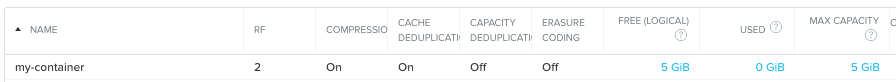
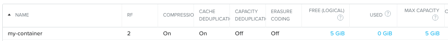
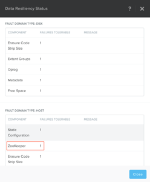

.. _lab_storage_configuration:

---------------------------
Lab - Storage Configuration
---------------------------

Overview
++++++++

In this lab we will use Prism to perform a basic container setup.

Prism Element Storage Configuration Items
+++++++++++++++++++++++++++++++++++++++++

Configure Storage Containers
............................

**Containers** are software-defined, logical constructs for managing storage policy that greatly simplify storage management. Containers are similar to datastores in ESXi.

Let's use Prism Element to perform a basic container setup.

In **Prism > Storage**, click **Storage**, click **Table**, then click **+ Storage Container**.

Use the following specifications (with **Advance Settings**), and click **Save**:

- **Name** - container-*intials*
- **Advertised Capacity** - 5 GiB
- **Compression** - Enabled (inline 0 mins)
- **Deduplication** - Cache Only
- **Erasure Coding** - Disabled

You can create multiple containers with different policies.

.. note::

  Containers do not reserve any actual disk space—they are policies with a soft limit that trigger alerts but do not stop new data from being written to the container.

Explore the configuration basics further.

Go back to the container you created above and try adding another 10 GiB to the advertised capacity. While you’re in that window, what is the redundancy factor for the container you created in the first task?

Redundancy Factor (RF)
.................

We have discussed how Nutanix clusters handle data: reads, writes, CVM auto-pathing, data locality, intelligent tiering, and seamless VM migrations. While leveraging these features and capabilities, Nutanix clusters continuously monitor and handle data placement in order to optimize performance and allow clusters to maintain high availability during software upgrades and failures.

You can locate the redundancy level of containers and the cluster within Prism, and how many ZooKeeper nodes can be tolerated.

Block awareness, introduced in 4.0, allows the cluster to survive a full 2RU block failure without using any more disk space.The basic requirement for rack/block fault tolerance is to have minimum 3 blocks in the cluster as we need to store 3 copies of metadata.
Starting in AOS 5.8, block awareness is supported in conjunction with erasure coding.

In **Prism > Home**, click the **green OK** in the Data Resiliency Status box. This opens the Data Resiliency Status window.

.. note::
The RF of a cluster in Prism Element could be configured by clicking **Redundancy State** in the Gear menu.

.. note::

  For this exercise, please leave the redundancy factor configured as 2.

In **Prism >** :fa:`cog`, click **Redundancy State**.

Takeaways
+++++++++

- The default cluster redundancy factor is set to 2. Clusters with a redundancy factor of 2 have 1/2 of the total usable space (30 TB = 15 TB usable space) because there are two copies of the data kept.
- A ZooKeeper failures tolerable of 1 means that one component in the cluster (one CVM, one NIC, one disk, and so on) can be down without impacting data resiliency. A failures tolerable of 2 means two components in the cluster can be down without impacting data resiliency. The two components can be different types.
