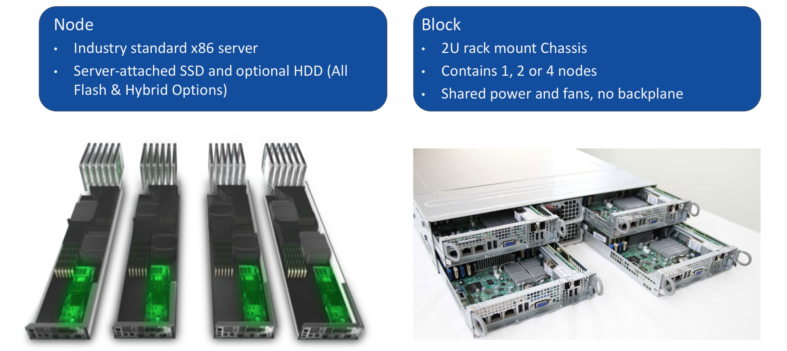
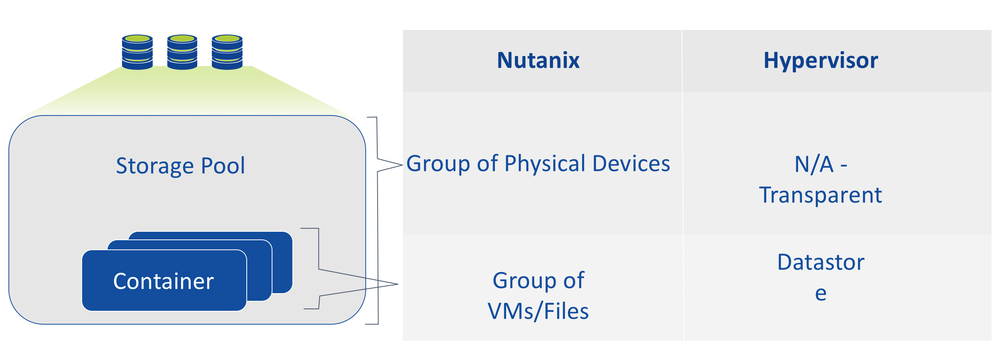
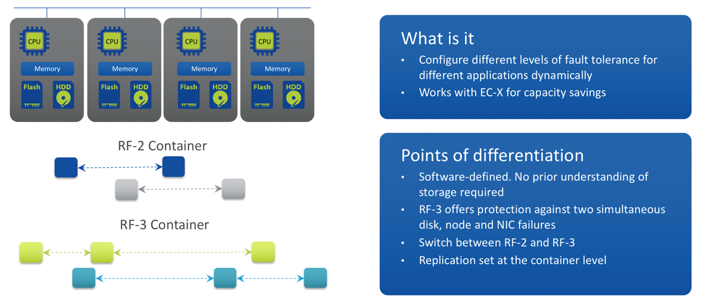
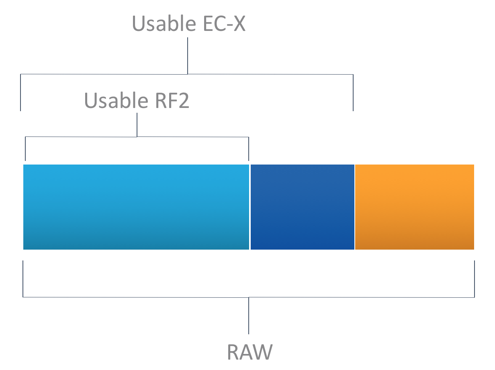
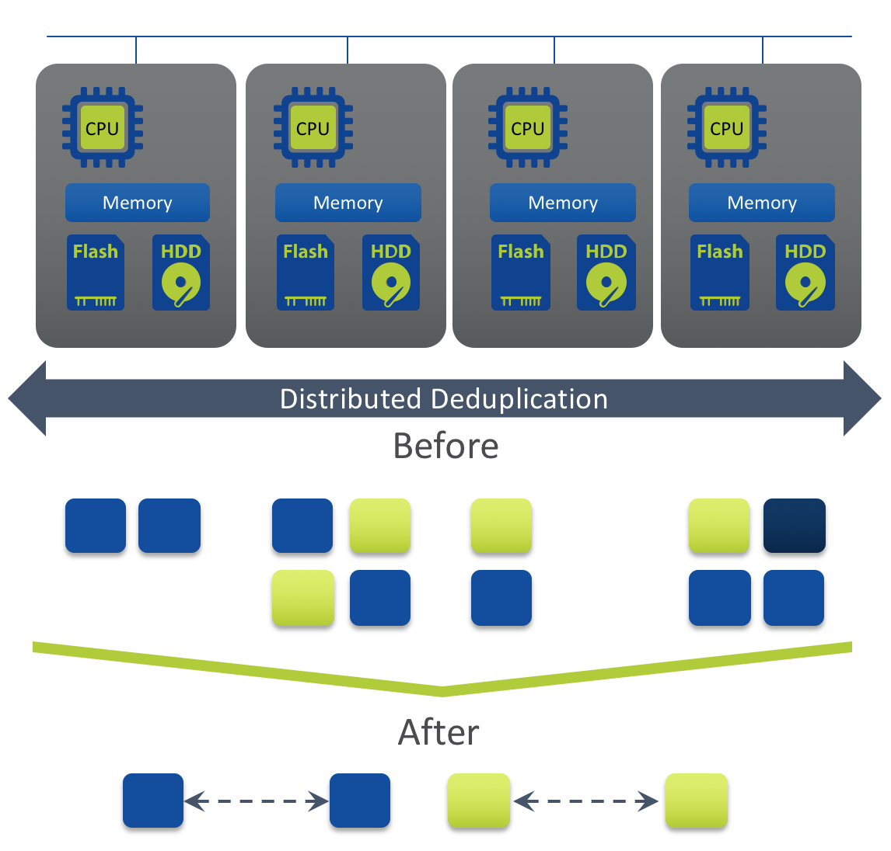

.. _nutanix_terminology:

-------------------
Nutanix Terminology
-------------------

Nutanix HCI Terminology
+++++++++++++++++++++++

Physical Infrastructure Terminology
...................................

A Nutanix cluster is made up of Nodes and Blocks.

Storage Pools and Containers
............................

Nutanix presents the physical disks as one **Storage Pool**, that can be divided into one or more **Containers**.

Tunable Redundancy
..................

Nutanix EC-X (Erasure Coding)
.............................

- No overhead to the active write path
- Background job
- Only cold data is subject to EC-X
- Lower rebuild times (equal or better than RF2)
- Patent pending algorithm

Deduplication
.............

- Inline fingerprinting with post-process deduplication
- Distributed across all nodes – true scale-out
- Global deduplication across entire cluster
- SHA-1 fingerprinting offloaded to Intel processors for greater efficiency
- 100% software-defined
- Strong hash allows dedupe to happen based on metadata match

Compression
...........

- Inline and post-process compression
- Inline: Data compressed as it’s written
- MapReduce: Data compressed after “cold” data is migrated to lower-performance storage tiers
- No impact to normal IO path
- Ideal for random batch workloads
- Uses LZH4c algorithm (AOS 5+)
